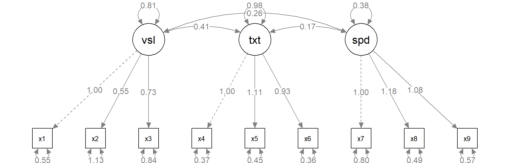
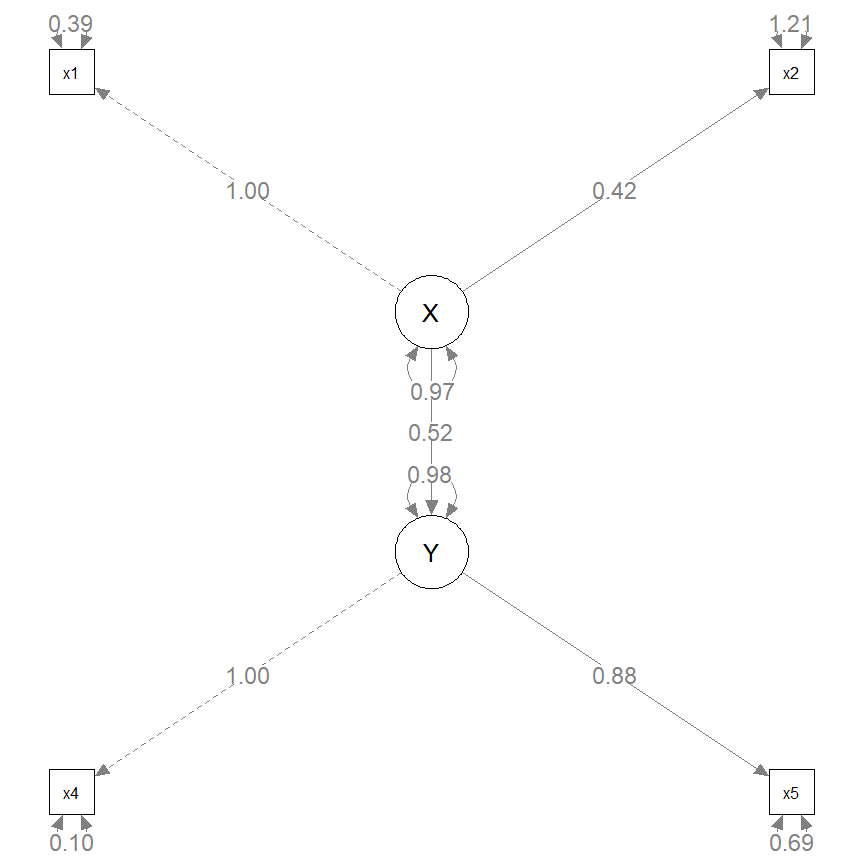
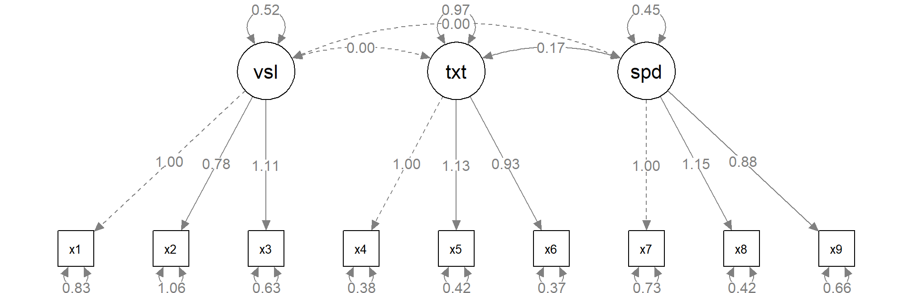
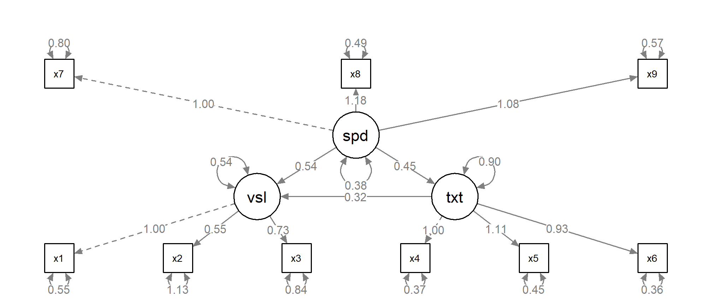

<style>
.small-code pre code {
  font-size: 15pt;
}

code {
   background-color: #efefef;
   font-weight:bold;
}
</style>

Structural Equation Models in R with lavaan
========================================================
author: Charles Lanfear
date: April 12th, 2018
width: 1600
height: 900
font-family: Helvetica

This Presentation
========================================================

All files, including source code, for this presentation can be found on my [GitHub at https://github.com/clanfear/lavaan_tutorial/](https://github.com/clanfear/lavaan_tutorial/)

If you wish, you may download these files and follow along using either the `.Rpres` or `.R` files.


R and RStudio
========================================================
incremental: true

R is a programming language built for statistical computing.

If one already knows MPlus, LISREL, or similar software, why use R for SEM?

* R is free, so you don't need a terminal server.
* R has a very large community that provides support.
* R can handle virtually any data format.
* R is makes replication easy, particularly with RStudio.
* R is a programming *language* so it can do *everything*.

lavaan
========================================================
incremental: true

`lavaan`, short for *latent variable analysis*, is an R package that...

* Handles general structural equation modeling
* Uses *much* simpler syntax than Lisrel and MPlus
* Has a large range of estimators and options
* Easily fits into a reproducible R workflow

Installing 
========================================================

We'll be using two packages in these examples: `lavaan` and `semPlot`

If you do not have these installed, install them as you would any other packages:


```r
install.packages("lavaan")
install.packages("semPlot")
```

Then load with `library()`


```r
library(lavaan)
library(semPlot)
```

Example Data
========================================================

We will be using the example data built into `lavaan` to explore its syntax and output.


```r
data(HolzingerSwineford1939)
```

These data are commonly used in SEM examples in textbooks and articles. For more information you can enter `?HolzingerSwineford1939` in the console to open the description file for the dataset.

lavaan Syntax: Operators
========================================================
incremental: true

`lavaan` uses a simplified syntax using three primary operators:

* `~` for regressions
* `=~` for latent variables
* `~~` for variances and covariances

Every model will be specified with *strings of text* containing some combination of these three operators.

lavaan Functions
========================================================
incremental: true

`lavaan` uses three primary functions for estimating models:

* `cfa()` for Confirmatory Factor Analysis
* `sem()` for Structural Equation Models
* `lavaan()` for *all* models.

These functions actually only differ by their *default arguments*. You can see what these defaults are by getting help on each function (e.g. `?cfa`).

I typicaly use `sem()` for everything because I am used to its defaults and am normally estimating conventional structural equation models.

lavaan Syntax: Linear regression
========================================================

Most or all of you are probably familiar with specifying a linear regression in R:


```r
lm_out_1 <- lm(x4 ~ ageyr, data=HolzingerSwineford1939)
```

We can specify a simple linear regression in lavaan similarly


```r
sem_out_1 <- sem('x4 ~ ageyr', data=HolzingerSwineford1939)
```

This indicates that `x4` is regressed on `ageyr`; the dependent variable goes on the left of `~` and independent variables on the right.

Note the formulas for `lavaan` calls are *in quotes*: `lavaan` requires text input, which it converts into individual equations internally.

lavaan Output: Linear regression
========================================================
class: small-code


```r
summary(lm_out_1)
```

```

Call:
lm(formula = x4 ~ ageyr, data = HolzingerSwineford1939)

Residuals:
     Min       1Q   Median       3Q      Max 
-2.94620 -0.72685 -0.06018  0.60649  3.15918 

Coefficients:
            Estimate Std. Error t value Pr(>|t|)    
(Intercept)  5.91179    0.81917   7.217 4.41e-12 ***
ageyr       -0.21935    0.06282  -3.492 0.000553 ***
---
Signif. codes:  0 '***' 0.001 '**' 0.01 '*' 0.05 '.' 0.1 ' ' 1

Residual standard error: 1.143 on 299 degrees of freedom
Multiple R-squared:  0.03917,	Adjusted R-squared:  0.03596 
F-statistic: 12.19 on 1 and 299 DF,  p-value: 0.0005527
```

***


```r
summary(sem_out_1)
```

```
lavaan (0.6-1.1207) converged normally after   9 iterations

  Number of observations                           301

  Estimator                                         ML
  Model Fit Test Statistic                       0.000
  Degrees of freedom                                 0

Parameter Estimates:

  Information                                 Expected
  Information saturated (h1) model          Structured
  Standard Errors                             Standard

Regressions:
                   Estimate  Std.Err  z-value  P(>|z|)
  x4 ~                                                
    ageyr            -0.219    0.063   -3.503    0.000

Variances:
                   Estimate  Std.Err  z-value  P(>|z|)
   .x4                1.298    0.106   12.268    0.000
```

lavaan Syntax: CFA
========================================================

Normally we would only use `lavaan` if we are interested in multiple equations. For more complex models, we will want to create a `lavaan` formula as a separate object before sending it to a `lavaan` function.

Here is syntax for three-factor CFA / latent variable model:


```r
cfa_mod_1 <- '
   visual  =~ x1 + x2 + x3
   textual =~ x4 + x5 + x6
   speed   =~ x7 + x8 + x9
'
cfa_out_1 <- cfa(cfa_mod_1, data=HolzingerSwineford1939)
```

For latent variables, we give a name for the construct on the left of `=~` and indicators on the right.

Here we have defined three latent (unobserved) variables, `visual`, `textual`, and `speed`, each with three observed indicators.

lavaan Output: CFA
========================================================
class: small-code
incremental: true


```r
summary(cfa_out_1)
```

```
lavaan (0.6-1.1207) converged normally after  35 iterations

  Number of observations                           301

  Estimator                                         ML
  Model Fit Test Statistic                      85.306
  Degrees of freedom                                24
  P-value (Chi-square)                           0.000

Parameter Estimates:

  Information                                 Expected
  Information saturated (h1) model          Structured
  Standard Errors                             Standard

Latent Variables:
                   Estimate  Std.Err  z-value  P(>|z|)
  visual =~                                           
    x1                1.000                           
    x2                0.554    0.100    5.554    0.000
    x3                0.729    0.109    6.685    0.000
  textual =~                                          
    x4                1.000                           
    x5                1.113    0.065   17.014    0.000
    x6                0.926    0.055   16.703    0.000
  speed =~                                            
    x7                1.000                           
    x8                1.180    0.165    7.152    0.000
    x9                1.082    0.151    7.155    0.000

Covariances:
                   Estimate  Std.Err  z-value  P(>|z|)
  visual ~~                                           
    textual           0.408    0.074    5.552    0.000
    speed             0.262    0.056    4.660    0.000
  textual ~~                                          
    speed             0.173    0.049    3.518    0.000

Variances:
                   Estimate  Std.Err  z-value  P(>|z|)
   .x1                0.549    0.114    4.833    0.000
   .x2                1.134    0.102   11.146    0.000
   .x3                0.844    0.091    9.317    0.000
   .x4                0.371    0.048    7.779    0.000
   .x5                0.446    0.058    7.642    0.000
   .x6                0.356    0.043    8.277    0.000
   .x7                0.799    0.081    9.823    0.000
   .x8                0.488    0.074    6.573    0.000
   .x9                0.566    0.071    8.003    0.000
    visual            0.809    0.145    5.564    0.000
    textual           0.979    0.112    8.737    0.000
    speed             0.384    0.086    4.451    0.000
```

***

`lavaan` produces a lot of output once you give it more complex models!

When using the `cfa()` or `sem()` functions, `lavaan`...

* Automatically sets the first indicator coefficient to `1`
* Estimates covariances between latent variables
* Estimates variances for all latent and observed variables
* Defaults to a Maximum-Likelihood estimator.

You can also use `parameterEstimates()` to extract `lavaan` estimates as a data frame, similar to `tidy()` in the `broom`.

This is good if you want to create nice results tables or plot estimates using `ggplot2`.

lavaan parameterEstimates()
========================================================
class: small-code


```r
parameterEstimates(cfa_out_1)
```

```
       lhs op     rhs   est    se      z pvalue ci.lower ci.upper
1   visual =~      x1 1.000 0.000     NA     NA    1.000    1.000
2   visual =~      x2 0.554 0.100  5.554      0    0.358    0.749
3   visual =~      x3 0.729 0.109  6.685      0    0.516    0.943
4  textual =~      x4 1.000 0.000     NA     NA    1.000    1.000
5  textual =~      x5 1.113 0.065 17.014      0    0.985    1.241
6  textual =~      x6 0.926 0.055 16.703      0    0.817    1.035
7    speed =~      x7 1.000 0.000     NA     NA    1.000    1.000
8    speed =~      x8 1.180 0.165  7.152      0    0.857    1.503
9    speed =~      x9 1.082 0.151  7.155      0    0.785    1.378
10      x1 ~~      x1 0.549 0.114  4.833      0    0.326    0.772
11      x2 ~~      x2 1.134 0.102 11.146      0    0.934    1.333
12      x3 ~~      x3 0.844 0.091  9.317      0    0.667    1.022
13      x4 ~~      x4 0.371 0.048  7.779      0    0.278    0.465
14      x5 ~~      x5 0.446 0.058  7.642      0    0.332    0.561
15      x6 ~~      x6 0.356 0.043  8.277      0    0.272    0.441
16      x7 ~~      x7 0.799 0.081  9.823      0    0.640    0.959
17      x8 ~~      x8 0.488 0.074  6.573      0    0.342    0.633
18      x9 ~~      x9 0.566 0.071  8.003      0    0.427    0.705
19  visual ~~  visual 0.809 0.145  5.564      0    0.524    1.094
20 textual ~~ textual 0.979 0.112  8.737      0    0.760    1.199
21   speed ~~   speed 0.384 0.086  4.451      0    0.215    0.553
22  visual ~~ textual 0.408 0.074  5.552      0    0.264    0.552
23  visual ~~   speed 0.262 0.056  4.660      0    0.152    0.373
24 textual ~~   speed 0.173 0.049  3.518      0    0.077    0.270
```

semPlot Output
========================================================

We can get a simple diagram of our CFA using `semPaths()` in the `semPlot` package.


```r
semPaths(cfa_out_1, whatLabels = "est")
```



lavaan Syntax: Walking dog
========================================================

The walking dog model is a common SEM example. It features two latent variables, each with two indicators, and a regression between them.


```r
wd_mod_1 <- '
   X =~ x1 + x2
   Y =~ x4 + x5
   Y ~ X
'
wd_out_1 <- sem(wd_mod_1, data=HolzingerSwineford1939)
```

lavaan Output: Walking dog
========================================================
class: small-code


```r
summary(wd_out_1)
```

```
lavaan (0.6-1.1207) converged normally after  32 iterations

  Number of observations                           301

  Estimator                                         ML
  Model Fit Test Statistic                       0.252
  Degrees of freedom                                 1
  P-value (Chi-square)                           0.616

Parameter Estimates:

  Information                                 Expected
  Information saturated (h1) model          Structured
  Standard Errors                             Standard

Latent Variables:
                   Estimate  Std.Err  z-value  P(>|z|)
  X =~                                                
    x1                1.000                           
    x2                0.421    0.150    2.811    0.005
  Y =~                                                
    x4                1.000                           
    x5                0.880    0.116    7.571    0.000

Regressions:
                   Estimate  Std.Err  z-value  P(>|z|)
  Y ~                                                 
    X                 0.521    0.181    2.876    0.004

Variances:
                   Estimate  Std.Err  z-value  P(>|z|)
   .x1                0.390    0.325    1.201    0.230
   .x2                1.210    0.114   10.617    0.000
   .x4                0.103    0.153    0.676    0.499
   .x5                0.694    0.131    5.292    0.000
    X                 0.969    0.340    2.849    0.004
   .Y                 0.985    0.192    5.134    0.000
```

semPlot Output: Walking dog
========================================================


```r
semPaths(wd_out_1, whatLabels = "est")
```



lavaan Syntax: Fixing coefficients
========================================================

Often when estimating a model, we want to fix particular coefficients to a certain value. We can do this in `lavaan` using pre-multiplication.


```r
wd_mod_2 <- '
   X =~ 1*x1 + 1*x2
   Y =~ 1*x4 + 1*x5
   Y ~ X
'
wd_out_2 <- sem(wd_mod_2, data=HolzingerSwineford1939)
```

lavaan Output: Fixed coefficients
========================================================
class: small-code


```r
summary(wd_out_2)
```

```
lavaan (0.6-1.1207) converged normally after  20 iterations

  Number of observations                           301

  Estimator                                         ML
  Model Fit Test Statistic                      10.819
  Degrees of freedom                                 3
  P-value (Chi-square)                           0.013

Parameter Estimates:

  Information                                 Expected
  Information saturated (h1) model          Structured
  Standard Errors                             Standard

Latent Variables:
                   Estimate  Std.Err  z-value  P(>|z|)
  X =~                                                
    x1                1.000                           
    x2                1.000                           
  Y =~                                                
    x4                1.000                           
    x5                1.000                           

Regressions:
                   Estimate  Std.Err  z-value  P(>|z|)
  Y ~                                                 
    X                 0.870    0.181    4.794    0.000

Variances:
                   Estimate  Std.Err  z-value  P(>|z|)
   .x1                0.873    0.101    8.679    0.000
   .x2                1.053    0.111    9.448    0.000
   .x4                0.239    0.059    4.083    0.000
   .x5                0.576    0.072    7.945    0.000
    X                 0.415    0.083    5.014    0.000
   .Y                 0.790    0.115    6.881    0.000
```

lavaan Syntax: Equality constraints
========================================================

We can use similar syntax to fix constrain coefficients to be the same value, which is still estimated.

In this case, I am forcing the coefficients on the second indicators to have the same coefficient.


```r
wd_mod_3 <- '
   X =~ x1 + b1*x2
   Y =~ x4 + b1*x5
   Y ~ X
'
wd_out_3 <- sem(wd_mod_3, data=HolzingerSwineford1939)
```

This is sometimes a necessary constraint for identification!

lavaan Output: Equality constraints
========================================================
class: small-code


```r
summary(wd_out_3)
```

```
lavaan (0.6-1.1207) converged normally after  29 iterations

  Number of observations                           301

  Estimator                                         ML
  Model Fit Test Statistic                       5.758
  Degrees of freedom                                 2
  P-value (Chi-square)                           0.056

Parameter Estimates:

  Information                                 Expected
  Information saturated (h1) model          Structured
  Standard Errors                             Standard

Latent Variables:
                   Estimate  Std.Err  z-value  P(>|z|)
  X =~                                                
    x1                1.000                           
    x2        (b1)    0.738    0.102    7.202    0.000
  Y =~                                                
    x4                1.000                           
    x5        (b1)    0.738    0.102    7.202    0.000

Regressions:
                   Estimate  Std.Err  z-value  P(>|z|)
  Y ~                                                 
    X                 0.750    0.166    4.516    0.000

Variances:
                   Estimate  Std.Err  z-value  P(>|z|)
   .x1                0.733    0.128    5.714    0.000
   .x2                1.121    0.110   10.162    0.000
   .x4               -0.100    0.192   -0.521    0.603
   .x5                0.830    0.124    6.669    0.000
    X                 0.587    0.133    4.421    0.000
   .Y                 1.116    0.242    4.612    0.000
```

lavaan Syntax: Fixing covariances
========================================================

We can also constrain covariances to `0` with the same basic syntax.


```r
cfa_mod_2 <- '
   visual  =~ x1 + x2 + x3
   textual =~ x4 + x5 + x6
   speed   =~ x7 + x8 + x9
   
   visual  ~~ 0*textual + 0*speed
'
cfa_out_2 <- cfa(cfa_mod_2, data=HolzingerSwineford1939)
```

For covariances, you can have only one variable left of `~~` but multiple on the right.

Here we have made the assumption that the `visual` latent construct is **orthogonal** to `textual` and `speed`.

lavaan Output: Fixed covariances
========================================================
class: small-code


```r
summary(cfa_out_2)
```

```
lavaan (0.6-1.1207) converged normally after  33 iterations

  Number of observations                           301

  Estimator                                         ML
  Model Fit Test Statistic                     140.599
  Degrees of freedom                                26
  P-value (Chi-square)                           0.000

Parameter Estimates:

  Information                                 Expected
  Information saturated (h1) model          Structured
  Standard Errors                             Standard

Latent Variables:
                   Estimate  Std.Err  z-value  P(>|z|)
  visual =~                                           
    x1                1.000                           
    x2                0.778    0.141    5.532    0.000
    x3                1.107    0.214    5.173    0.000
  textual =~                                          
    x4                1.000                           
    x5                1.132    0.067   16.954    0.000
    x6                0.925    0.056   16.438    0.000
  speed =~                                            
    x7                1.000                           
    x8                1.150    0.165    6.990    0.000
    x9                0.878    0.123    7.166    0.000

Covariances:
                   Estimate  Std.Err  z-value  P(>|z|)
  visual ~~                                           
    textual           0.000                           
    speed             0.000                           
  textual ~~                                          
    speed             0.173    0.052    3.331    0.001

Variances:
                   Estimate  Std.Err  z-value  P(>|z|)
   .x1                0.835    0.118    7.064    0.000
   .x2                1.065    0.105   10.177    0.000
   .x3                0.633    0.129    4.899    0.000
   .x4                0.382    0.049    7.854    0.000
   .x5                0.418    0.059    7.113    0.000
   .x6                0.367    0.044    8.374    0.000
   .x7                0.729    0.084    8.731    0.000
   .x8                0.422    0.084    5.039    0.000
   .x9                0.665    0.071    9.383    0.000
    visual            0.524    0.130    4.021    0.000
    textual           0.969    0.112    8.647    0.000
    speed             0.454    0.096    4.728    0.000
```

semPlot Output: Fixed covariances
========================================================


```r
semPaths(cfa_out_2, whatLabels = "est")
```



lavaan Syntax: Complex models
========================================================

We can put multiple latent variables, regressions, and covariances together to build complex models.

Here is a three factor mediation model. `visual` is dependent on `textual` and `speed` but the effect of `speed` is also mediated by `textual`.


```r
complex_mod_1 <- '
   visual  =~ x1 + x2 + x3
   textual =~ x4 + x5 + x6
   speed   =~ x7 + x8 + x9
   
   visual  ~ textual + speed
   textual ~ speed
'
complex_out_1 <- sem(complex_mod_1, data=HolzingerSwineford1939)
```


lavaan Output: Complex model
========================================================
class: small-code


```r
parameterEstimates(complex_out_1)
```

```
       lhs op     rhs   est    se      z pvalue ci.lower ci.upper
1   visual =~      x1 1.000 0.000     NA     NA    1.000    1.000
2   visual =~      x2 0.554 0.100  5.554      0    0.358    0.749
3   visual =~      x3 0.729 0.109  6.685      0    0.516    0.943
4  textual =~      x4 1.000 0.000     NA     NA    1.000    1.000
5  textual =~      x5 1.113 0.065 17.014      0    0.985    1.241
6  textual =~      x6 0.926 0.055 16.703      0    0.817    1.035
7    speed =~      x7 1.000 0.000     NA     NA    1.000    1.000
8    speed =~      x8 1.180 0.165  7.152      0    0.857    1.503
9    speed =~      x9 1.082 0.151  7.155      0    0.785    1.378
10  visual  ~ textual 0.321 0.067  4.776      0    0.190    0.453
11  visual  ~   speed 0.538 0.130  4.152      0    0.284    0.792
12 textual  ~   speed 0.452 0.124  3.654      0    0.210    0.695
13      x1 ~~      x1 0.549 0.114  4.833      0    0.326    0.772
14      x2 ~~      x2 1.134 0.102 11.146      0    0.934    1.333
15      x3 ~~      x3 0.844 0.091  9.317      0    0.667    1.022
16      x4 ~~      x4 0.371 0.048  7.778      0    0.278    0.465
17      x5 ~~      x5 0.446 0.058  7.642      0    0.332    0.561
18      x6 ~~      x6 0.356 0.043  8.277      0    0.272    0.441
19      x7 ~~      x7 0.799 0.081  9.823      0    0.640    0.959
20      x8 ~~      x8 0.488 0.074  6.573      0    0.342    0.633
21      x9 ~~      x9 0.566 0.071  8.003      0    0.427    0.705
22  visual ~~  visual 0.537 0.117  4.582      0    0.307    0.767
23 textual ~~ textual 0.901 0.106  8.496      0    0.693    1.109
24   speed ~~   speed 0.384 0.086  4.451      0    0.215    0.553
```

semPlot Output: Complex model
========================================================


```r
semPaths(complex_out_1, whatLabels = "est")
```



Other lavaan Features
========================================================

`lavaan` is highly customizable and contains many features useful for fitting complex structural equations.

Three examples you may find useful:

* Alternate **estimators**
* Proper treatment of **categorical variables**
* Input using **covariance matrices**
* **Additional arguments** for specifying models

Feature: Alternate estimators
========================================================

`lavaan` defaults to using a full-information Maximum-Likelihood (ML) Estimator. This is the most efficient estimator available and can handle missing data.

We may want to specify alternate estimators if our data do not meet the assumptions for ML.

By adding the `estimator=` argument to our `cfa()`, `sem()`, or `lavaan()` call, we can choose another estimator.

Some useful choices:

* `estimator="MLM"`: ML with robust errors and Satorra-Bentler test statistic.
* `estimator="WLSMV"`: Weighted least squares with mean and variance adjusted test statistic (needed for categorical endogenous variables).

Example `sem()` call:

```
sem(complex_mod_1, data=HolzingerSwineford1939, estimator="MLM")
```

Feature: Categorical variables
========================================================

If you provide `lavaan` categorical data as an endogenous variable, it will automatically use
a proper estimator (e.g. Diagonally Weighted Least Squares).

To specify an ordinal variable as categorical, you will want to make it an *ordered factor*:

Base R syntax:
```
data$cat_var <- ordered(data$cat_var)
```

`dplyr` syntax:
```
data <- data %>% mutate(cat_var=ordered(cat_var))
```

Unordered categorical variables (factors) will need to be split into dummy variables prior to estimation.

Feature: Covariance matrix input
========================================================

Like LISREL, `lavaan` also accepts inputting data as a raw covariance matrix.

Here is example syntax from the `lavaan` tutorial page using the lower half of a covariance matrix combined with the `getCov()` function to create a full covariance matrix with variable names. Note the use of `sample.cov=` and `sample.nobs=` arguments to `sem()` instead of `data=`.

```
lower <- '
 11.834
  6.947   9.364
  6.819   5.091  12.532
  4.783   5.028   7.495   9.986
 -3.839  -3.889  -3.841  -3.625  9.610
-21.899 -18.831 -21.748 -18.775 35.522 450.288 '

wheaton.cov <- 
    getCov(lower, names = c("anomia67", "powerless67", "anomia71", 
                            "powerless71", "education", "sei"))

fit <- sem(wheaton.model, sample.cov = wheaton.cov, sample.nobs = 932)
```

Feature: Additional arguments
========================================================

Most of the time you will be fine with `lavaan`'s default settings. 

However, there are many, many arguments you can give to `sem()`, `cfa()`, or `lavaan()` to adjust how models are estimated.

To see these arguments, view the help files using `?lavaan` and `?lavOptions`.

Getting Help
========================================================

Because `lavaan` is a complex package and structural equation models are a deep field in statistics, you are likely to run into issues eventually (or constantly).

You can find a more detailed `lavaan` tutorial and a number of resources via the [official `lavaan` website](http://lavaan.ugent.be/).

For troubleshooting, the [`lavaan` Google group](https://groups.google.com/forum/#!forum/lavaan) is very active and frequented by the package authors.

`lavaan` is in constant development, so you may want to check the [GitHub repository](https://github.com/yrosseel/lavaan) for current issues or new features.

If you need a new feature or bug fix from the development version, you can install it using `install_github()` in the `devtools` package.
